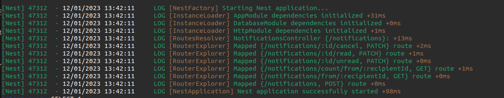
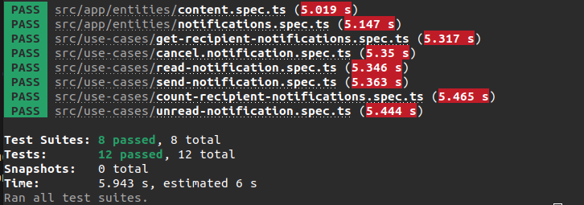

<h1 align=center >💬 Microsserviço de notificação 💬</h1>

## Arquitetura de microsserviços são

### uma abordagem arquitetônica e organizacional do desenvolvimento de software na qual o software consiste em pequenos serviços independentes que se comunicam usando APIs bem definidas

<hr>

## Exemplo visual de um microsserviço


<hr>

## Requisitos par iniciar um projeto

#### - [Git](https://git-scm.com/)

#### - [NodeJs](https://nodejs.org/en/)

#### Algum API Client de REST api

#### - [Postman](https://www.postman.com/)

#### Ou

#### - [Insomnia](https://insomnia.rest/download)

<hr>

## Ferramentas usadas no projeto

### - Nest TS

### - Prisma client

### - SQlite

### - Jest

<hr>

## Inciando o projeto

### Clonando o projeto e entrando no projeto

```bash
git clone https://github.com/rafaelmasselli/

cd microservices-notifications-nestTs
```

### Instalando a dependências do projeto

```bash
npm i
```

### Iniciando o banco de dados e o projeto

```bash
npx prisma migrate dev

npm run start:dev
```

### E assim ira abrir o projeto



### Testando o projeto com Jest

```bash
### Iniciando os testes
$ npm test
```

#### Resultado do test



<hr>

### Criando uma nova notificação na porta <http://localhost:3000/notifications> com o método POST

#### Exemplo de um json para criar uma notificação

```bash
{
    "content": "Hello world",
    "category": "social",
    "recipientId" : "21dbfb36-0e16-425a-be29-3037d45053b2"
}
```

### Visualizando todas as notificações de um determinado tema/ID, na porta <http://localhost:3000/notifications/from/21dbfb36-0e16-425a-be29-3037d45053b2> com o método GET

#### Retorno


### Visualizando quantas notificações um usuario tem de um determinado tema/ID, na porta <http://localhost:3000/notifications/count/from/21dbfb36-0e16-425a-be29-3037d45053b2>

#### Retorno

```bash
{
    "count": 9
}
```
